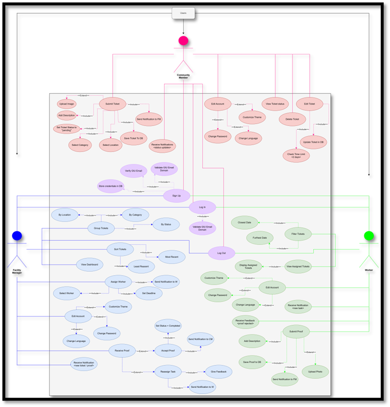
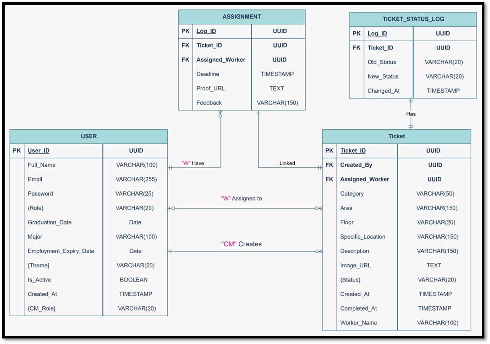

Facility Management System

**Course:** Software Engineering (INCS617)  
**Semester:** Spring 2026  
**Instructor:** Dr. Iman Awad  
**Teaching Assistants:** Mr. Moamen Atia

---

## 0. Team Members

| Name             | Student ID | Tutorial Group | GitHub Username |
| :--------------- | :--------- | :------------- | :-------------- |
| Alya Nasef       | 13007317   | 1              | alya367         |
| Jana Youssef     | 13006399   | 1              | jana2-y         |
| Janna Tamer      | 13007689   | 1              | janna-77        |
| Lojaine Mostafa  | 13001415   | 1              | lojain3         |
| Noor Amr         | 13002764   | 1              | noornooh        |

---

## 1. Introduction 
Provides the purpose, intended audience, scope, and overview of the software. You may re-use the problem statement for this part of the introduction (before Section 1.1).

Campuses are valuable university assets that help improve productivity and create a positive institutional image. However, issues such as broken facilities, malfunctioning equipment, or cleanliness problems often go unreported or take too long to resolve due to inefficient communication channels. This system provides a formal and efficient way for GIU community members to report problems so they can be addressed quickly and effectively.
The application will allow users to report issues by submitting a ticket with a photo and/or text description of the problem, and specifying locations. The Facility Management team will then be able to review issues, assign workers, and update issue statuses through a centralized system.
### 1.1 Product Vision & Scope
Defines the overall goals of the system (You may re-use the overview section of the project description for this part). 

The system is a mobile application designed to support facility maintenance operations within the GIU campus. The application will allow community members, consisting of staff and students, to report issues by submitting photos, descriptions, and locations. The mobile application will be developed using React Native with Expo, while the backend will be implemented using Node.js with RESTful APIs and PostgreSQL as the database. Images will be stored using a supbase service. The system will support multiple user roles: community member, facility manager, admin and workers.

### 1.2 Definitions and Acronyms

SRS: Software Requirements Specification
Ticket: A digital record representing a maintenance issue
Task: A ticket assigned to a worker by a FM
RBAC: Role-Based Access Control
CM: Community Member
FM: Facility Manager
(U el S: the area between the a and the s)
(U el M: area in the dip of the m building)
…
## 2. Functional Requirements
Describes what the system should do, first in the form of user stories then as a list of functional requirements for each user/role. A UML use-case diagrams should then be included to link specific features and requirements. 
### 2.1 User Stories:
User 1: Community members
“As a community member I want to sign up using my GIU email so that my login credentials are registered in the database and I can log in using my email.”
 “As a community member I want an option to report an issue accurately using location, picture, category and a description on campus so that it is resolved as soon as possible.”
“As a Community Member, I should be able to add a description to the issue so that the worker understands the problem clearly.”
“As a Community Member, I should be able to view my submitted issues so that I can track their status.”
“As a community member I want to be notified when my report progresses to the next stage to track which stage of the lifecycle the ticket is at.”
“As a community member I want to be able to edit my account so that I can change my password if necessary and customize my display theme.”
“As a community member I want to have an option to edit my previously submitted tickets so that I can fix a previous mistake.”

User 2: Facility Managers
“As a facility manager I want to create an account so that I can log in to the application.” 
“As a facility manager I want to be able to log out and have my credentials secure on shared devices.”
“As a facility manager I want access to manage the assignment of workers and deadlines to each task to ensure a suitable worker is assigned, and a reasonable timeframe has been established.”
“As a facility manager I want a button that changes the status of each ticket at each stage so that the community members are notified.”
“As a facility manager I want a dashboard with all the reported problems, and the option to group them based on status, location, and category so that I can keep track of submitted reports.”
“As a facility manager I want to sort the tickets by most recent, least recent, or most popular (based on category and location) so that I can prioritize issues.”
“As a facility manager I want to receive a notification each time a community member submits a ticket, and when a worker submits proof of completion so that I approve changing the status.”
“As a facility manager I want to assign the workers credentials so that they can access their accounts, and so that they are registered as workers in the database since I know the who the GIU workers are.”
“As a facility manager I want to be able to give feedback to the worker if need be to ensure quality of work.”
“As a facility manager I want to have the option to reassign a task to a worker if I feel the work they have submitted was not up to standard to ensure quality of work.”
“As a Facility Manager, I should be able to close an issue after it is resolved so that the system reflects that the issue is completed.”

User 3: Workers
“As a worker I want to create an account so that I can log in to the application.”
“As a worker I want to log in using my email and password so that I can access the application.”
“As a worker I want to be able to log out and have my credentials secure on shared devices.”
“As a worker I want to receive a notification when a ticket has been assigned to me so that I know when to start.”
“As a worker I want a simple interface so that I don’t get confused by it.”
“As a worker I want to view all assigned tickets’ details so that I can keep track of them.”
“As a worker I want to be able to click accept on a task assigned to me by a FM and have that change the status to “In Progress””
“As a worker I want the option to submit a picture and description of the fix so that I have proof I completed them to the required standard.”
“As a worker I want to filter the assigned tickets by furthest or closest deadline so that I don’t miss my assignment deadlines.”
“As a worker I want to receive feedback on my work so that I know whether my work is up to standard or whether it needs to be re-done.”
(“As a worker I want a direct chat option with the facility manager that assigned my task to me so that I can communicate with them about any changes, misunderstandings, or required materials.”)

### 2.2 System Requirements:

(Submit ticket => pending =>assigned => in progress => either completed or [reassigned])
1.	The system should allow all users to sign up using their GIU email, and register their credentials securely in the database so that they can log in with them later.
2.	The system should authenticate the users using their GIU email based on their domain.
3.	Users are authorized by their GIU email, and they get sent a verification email.
4.	The system should allow the FM to post tasks to workers and assign a deadline for each task.
5.	The system allows only the FM to change the status of a ticket at each stage.
6.	The system allows CM to submit a ticket containing a picture with a size of x and a text box for adding a description, with a word limit of 100 words.
7.	System automatically notifies:
- CM when their report status changes, 
-FM when CM submits a ticket, and when worker submits proof of completion,
-And workers when they get assigned a task, when FM changes ticket status to done, and when a FM sends feedback on a submitted task.
8.	System should allow CM to change their password and customize their display theme (light, dark, and dracula)
9.	The system should allow CM to edit their previously submitted report submitted up to 2 days ago.
10.	 The system should present tickets only for the FM to view in a list, with the option to group them based on status, location and category, or sort them by most/ least recent or most popular (based on category and location).
11.	The system should delete inactive accounts automatically when they graduate
12.	The system allows FM to reassign tasks to workers if quality of work is unsatisfactory, with a new deadline and refined instructions
13.	The system allows the FM to give feedback on the worker’s tasks, be it positive or negative.
14.	The system provides a simpler interface for workers to avoid confusion.
15.	The system displays all of a workers tasks in a list with the option to filter by closest or furthest deadline.
16.	The system displays the worker’s feedback as a comment attached to the completed task.
17.	The worker can submit a picture and text description of the fix.
18.	There is a way for workers to contact the FM who assigned their task in order to communicate missing resources or changes.
### 2.2 UML Use-case Diagram

### 2.3 Non-functional Requirements:
Details the performance, usability, security, and other constraints of the system.

●	Response Time: Pages must be loaded within 3 seconds; ticket submission within 5 seconds; notifications delivered within 10 seconds.
●	Concurrent Users: System must support at least 500 simultaneous users during peak hours.
●	Usability: Intuitive UI; ticket submission under 1 minute; submission process ≤ >.< steps; ticket status clearly displayed.
●	Security & Access Control: Users log in with university credentials; passwords encrypted; ticket assignment restricted to authorized staff; users can only view their own tickets; data transmitted via HTTPS.
●	Reliability & Data Integrity: All tickets stored without loss; automatic daily backups; system recovery within 5 minutes of failure.
●	Availability: 24/7 availability except during scheduled maintenance; downtime ≤ 2 hours/month.
●	Audit & Logging: Record ticket creation date/time; log all ticket status changes; track which staff member updates or assigns tickets.
●	Data Retention: Resolved tickets stored for at least 1 year; (administrators can access historical tickets for reporting.)
●	Rate Limit
●	Scalability & Extensibility: Support future expansion to additional buildings/campuses; add new user roles without major system changes.
●	Image Handling: Support image uploads up to 10 MB; automatically compress images; robust handling even on unstable network connections. (based on supabase, edit if needed)

## 4. Future scope:
●	AI assistant (blue GIU bear mascot)
●	Community member dashboards
●	Admin
●	Dark mode + dracula

●	https://chatgpt.com/share/699d57dc-1a48-8012-8414-84b17d1d3555

## 5. Notes:
-	Gmail smtp or send grid for email verification during authorization

## 6. ERD:

## 7. Product BackLog

| Backlog ID | User Story ID | Priority |
| :--- | :--- | :--- |
| **Core System Features** | | |
| PB-01 | US-CM-01 | High |
| PB-02 | US-CM-02 | High |
| PB-03 | US-CM-03 | High | 
| PB-04 | US-CM-04 | High |
| PB-05 | US-CM-05 | High |
| PB-06 | US-CM-07 | High |
| PB-07 | US-FM-01 | High |
| PB-08 | US-FM-02 | High |
| PB-09 | US-W-01 | High |
| PB-10 | US-W-02 | High |
| **Issue Management Features** | | |
| PB-11 | US-FM-04 | High |
| PB-12 | US-FM-06 | High |
| PB-13 | US-W-04 | High |
| PB-14 | US-W-06 | High |
| PB-15 | US-W-05 | Medium |
| PB-16 | US-W-07 | Medium |
| PB-17 | US-FM-05 | High |
| PB-18 | US-FM-07 | High |
| **Authentication & Security** | | |
| PB-19 | US-CM-06 | Medium |
| PB-20 | US-FM-03 | Medium |
| PB-21 | US-W-03 | Medium |
